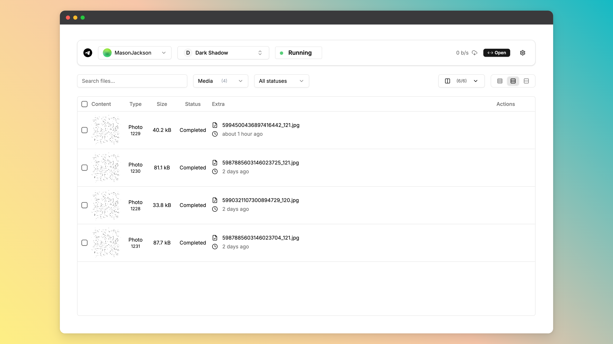
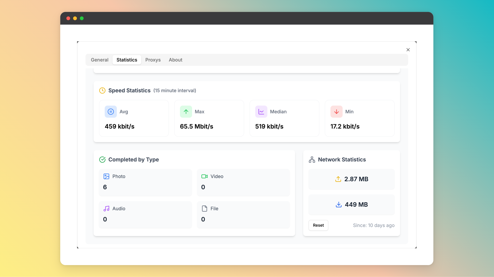
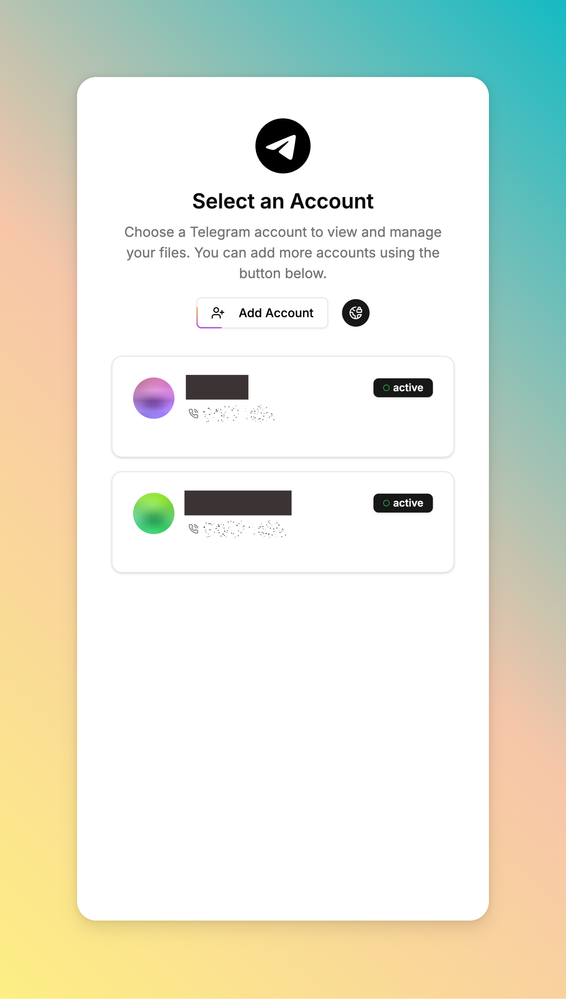
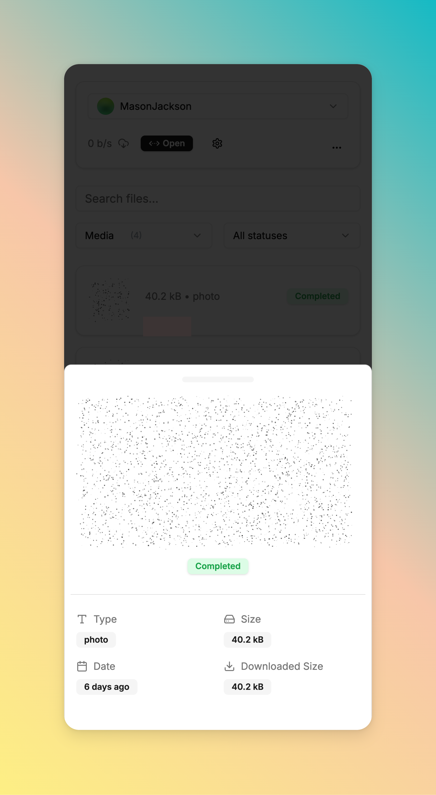

<p align="center">
    
</p>
<p align="center"><h1 align="center">Telegram Files</h1></p>
<p align="center">
	<em><code>A simple telegram file downloader.</code></em>
</p>
<p align="center">
	
	
	
	
</p>
<br>

## 🔗 Table of Contents

- [📍 Overview](#-overview)
- [🧩 Screenshots](#-screenshots)
- [🚀 Getting Started](#-getting-started)
- [⌨️ Development](#️-development)
    - [☑️ Prerequisites](#-prerequisites)
    - [⚙️ Installation](#-installation)
- [📌 Project Roadmap](#-project-roadmap)
- [🔰 Contributing](#-contributing)
- [🎗 License](#-license)
- [🆗 FAQs](#-faqs)

---

## 📍 Overview

* Support for downloading files from telegram channels and groups.
* Support multiple telegram accounts for downloading files.
* Support suspending and resuming downloads.
* Multiple accounts with same files will be downloaded only once.
* Responsive design supports mobile access.

---

## 🧩 Screenshots

<div align="center">
    
    
</div>

<details closed>
<summary>More Screenshots</summary>
<div align="center">
    
    
</div>
</details>

## 🚀 Getting Started

Before getting started with telegram-files, you should apply a telegram api id and hash. You can apply for it on the [Telegram API](https://my.telegram.org/apps) page.

**Using `docker`**
&nbsp; [](https://www.docker.com/)

```shell
docker run -d \
  --name telegram-files \
  --restart always \
  -e APP_ENV=${APP_ENV:-prod} \
  -e APP_ROOT=${APP_ROOT:-/app/data} \
  -e TELEGRAM_API_ID=${TELEGRAM_API_ID} \
  -e TELEGRAM_API_HASH=${TELEGRAM_API_HASH} \
  -p 6543:80 \
  -v ./data:/app/data \
  ghcr.io/jarvis2f/telegram-files:latest
```

**Using `docker-compose`**

Copy [docker-compose.yaml](docker-compose.yaml) to your project directory and run the following command:

```sh
docker-compose up -d
```

> **Important Note:** You should NOT expose the service to the public internet. Because the service is not secure.

---

## ⌨️ Development

### ☑️ Prerequisites

Before getting started with telegram-files, ensure your runtime environment meets the following requirements:

- **Programming Language:** JDK21,TypeScript
- **Package Manager:** Gradle,Npm
- **Container Runtime:** Docker

### ⚙️ Installation

Install telegram-files using one of the following methods:

**Build from source:**

1. Clone the telegram-files repository:

```sh
git clone https://github.com/jarvis2f/telegram-files
```

2. Navigate to the project directory:

```sh
cd telegram-files
```

3. Install the project dependencies:

**Using `npm`**
&nbsp; [](https://www.npmjs.com/)

```sh
cd web
npm install
```

**Using `gradle`**
&nbsp; [](https://gradle.org/)

```sh
cd api
gradle build
```

**Using `docker`**
&nbsp; [](https://www.docker.com/)

```sh
docker build -t jarvis2f/telegram-files .
```

## 📌 Project Roadmap

- ✅ **`Task 1`**: Automatically download files based on set rules.
- ✅ **`Task 2`**: Download statistics and reports.
- ☑️ **`Task 3`**: Improve Telegram’s login functionality.
- ☑️ **`Task 4`**: Support auto transfer files to other destinations.

---

## 🔰 Contributing

- **💬 [Join the Discussions](https://github.com/jarvis2f/telegram-files/discussions)**: Share your insights, provide
  feedback, or ask questions.
- **🐛 [Report Issues](https://github.com/jarvis2f/telegram-files/issues)**: Submit bugs found or log feature requests
  for the `telegram-files` project.
- **💡 [Submit Pull Requests](https://github.com/jarvis2f/telegram-files/blob/main/CONTRIBUTING.md)**: Review open PRs,
  and submit your own PRs.

<details closed>
<summary>Contributing Guidelines</summary>

1. **Fork the Repository**: Start by forking the project repository to your github account.
2. **Clone Locally**: Clone the forked repository to your local machine using a git client.
   ```sh
   git clone https://github.com/jarvis2f/telegram-files
   ```
3. **Create a New Branch**: Always work on a new branch, giving it a descriptive name.
   ```sh
   git checkout -b new-feature-x
   ```
4. **Make Your Changes**: Develop and test your changes locally.
5. **Commit Your Changes**: Commit with a clear message describing your updates.
   ```sh
   git commit -m 'Implemented new feature x.'
   ```
6. **Push to github**: Push the changes to your forked repository.
   ```sh
   git push origin new-feature-x
   ```
7. **Submit a Pull Request**: Create a PR against the original project repository. Clearly describe the changes and
   their motivations.
8. **Review**: Once your PR is reviewed and approved, it will be merged into the main branch. Congratulations on your
   contribution!

</details>

---

## 🎗 License

This project is protected under the MIT License. For more details,
refer to the [LICENSE](LICENSE) file.

---

## 🆗 FAQs

**Q.** Can't start the api server, error：`java.lang.UnsatisfiedLinkError: no tdjni in java.library.path`

**A.** Maybe download tdlib failed, you can see the [entrypoint.sh](entrypoint.sh) file, then download tdlib manually.

**Q.** Web's spoiler is static, how to solve it?

**A.** 1. Because `CSS Houdini Paint API` is not supported by all browsers. 2. It is only supported on https.
<details closed>
<summary>Use in http environment, you can use the following method to solve it</summary>

Open the `chrome://flags` page, search for `Insecure origins treated as secure`, and add the address of the web page to
the list.
</details>
